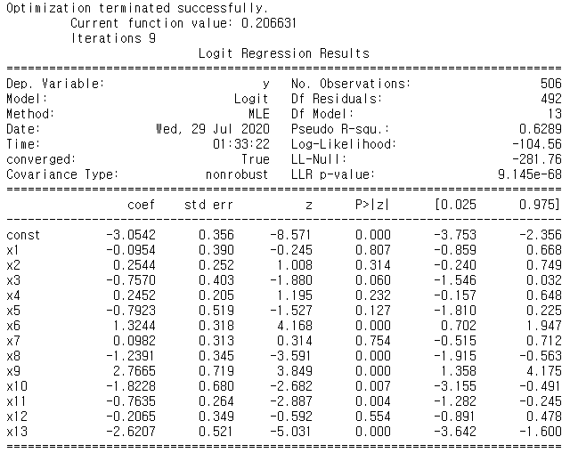

# 1. 숫자특성조정 (Data Transformation)

  

데이터 변환(Data transformation)의 의미는 다음과 같습니다.  

*In computing, **Data transformation** is the process of converting data from one format or structure into another format or structure.*

직역하자면 데이터변환은 한 형식·구조에서 다른 형식·구조로 변환하는 과정을 말합니다.  

데이터사이언스 관점에서 말하자면 데이터를 분석하기 좋은 형태로 바꾸는 과정을 말하죠.  

## 기존 방법의 문제점

분석을 정확하게 하려면, 원래 주어진 수치 값을 그대로 사용하면 안됩니다.  

***예시> 토익(만점 990), 토플(만점 120)으로 A양과 B군의 영어점수를 비교해보자*** 

*A양 : 토익 600점,  B군 : 토플 100점*  

- *데이터 변환 (X) : A양이 영어를 더 잘함 (600 > 100)*
- *평균중심화 : A양이 영어를 더 잘함 (600-495 > 100-60)*  
- *표준화 : A양이 영어를 더 잘함 ((600-495)/1 > (100-60)/1)*  
- *정규화 : B군이 영어를 더 잘함 (600/990 < 100/120)*  

위와 같은 예시로, 전처리 과정에 따라 결과가 달라질 수 있기 때문에 신중하게 사용해야 합니다.  

보스턴 주택 가격을 예시로 들어보죠.  

### 데이터 준비

```python
import numpy as np
import pandas as pd
import matplotlib.pyplot as plt
from sklearn.datasets import load_boston
from sklearn import linear_model
%matplotlib inline
np.set_printoptions(precision=5, suppress=True)

# ix -> iloc
boston = load_boston()
dataset = pd.DataFrame(boston.data, columns=boston.feature_names)
dataset['target'] = boston.target
observations = len(dataset)
variables = dataset.columns[:-1]
X = dataset.iloc[:,:-1]
y = dataset['target'].values

yq = np.array(y>25, dtype=int)
```

### 기존 방법

데이터 전처리를 하지 않고 그대로 선형회귀를 진행한 결과입니다.  

```python
from sklearn.preprocessing import StandardScaler
from sklearn.preprocessing import MinMaxScaler
linear_regression = linear_model.LinearRegression(normalize=False,
                                                 fit_intercept=True)
linear_regression.fit(X,y)
print("coefficients : %s\nintercept : %0.3f"
      %(linear_regression.coef_,linear_regression.intercept_))

'''
[Output]
coefficients : [ -0.10801   0.04642   0.02056   2.68673 -17.76661   3.80987   0.00069  -1.47557   0.30605  -0.01233  -0.95275   0.00931  -0.52476]  
intercept : 36.459  
'''
```

### 평균 중심화(Mean-Centering)  

평균(μ)만 일치시키고 선형회귀를 진행한 결과입니다.

```python
centering = StandardScaler(with_mean=True, with_std=False)
linear_regression.fit(centering.fit_transform(X),y)
print("coefficients : %s\nintercept : %0.3f"
      %(linear_regression.coef_,linear_regression.intercept_))

'''
[Output]
coefficients : [ -0.10801   0.04642   0.02056   2.68673 -17.76661   3.80987   0.00069  -1.47557   0.30605  -0.01233  -0.95275   0.00931  -0.52476]  
intercept : 22.533  
'''
```

### 표준화(Standardize)

평균(μ)과 표준편차(σ)까지 일치시키고 선형회귀를 진행한 결과입니다.

```python
standardization = StandardScaler(with_mean=True, with_std=True)
linear_regression.fit(standardization.fit_transform(X),y)
print("coefficients : %s\nintercept : %0.3f"
      %(linear_regression.coef_,linear_regression.intercept_))

'''
[Output]
coefficients : [-0.92815  1.08157  0.1409   0.68174 -2.05672  2.67423  0.01947 -3.10404  2.66222 -2.07678 -2.06061  0.84927 -3.74363]  
intercept : 22.533
'''
```
### 정규화(Normalization)

전체중에서 차지하는 비율(Portion)으로 선형회귀를 진행한 결과입니다.  

```python
scaling = MinMaxScaler(feature_range=(0,1))
linear_regression.fit(scaling.fit_transform(X),y)
print("coefficients : %s\nintercept : %0.3f"
      %(linear_regression.coef_,linear_regression.intercept_))

'''
[Output]
coefficients : [ -9.60976   4.64205   0.56084   2.68673  -8.63457  19.88369   0.06722 -16.22666   7.03914  -6.46333  -8.95582   3.69283 -19.01724]
intercept : 26.620  
'''
```

위와 같이 숫자특성을 어떻게 조정하냐에 따라 회귀분석의 결과가 크게 바뀔 수 있습니다.  


## 로지스틱회귀에서의 숫자특성조정
로지스틱회귀 문제에서 숫자특성을 조정하는 것은 위의 방법들과는 살짝 다릅니다. 로지스틱 회귀의 결과 종속변수 y가 0 또는 1을 갖기에, 단순 선형 함수 y=wx+b로는 풀기가 힘듭니다. 입력값이 커지면 출력값의 해석이 곤란해지기 때문이죠. 하지만 
### 데이터준비 
일반 선형회귀에서 사용했던 표준화된 독립변수들을 가져옵니다.
```python
import statsmodels.api as sm
Xq = sm.add_constant(standardization.fit_transform(X))
logit = sm.Logit(yq,Xq)
result = logit.fit()
print(result.summary())
```  
  
### 오즈비(Odds ratio)
```python
>> print('odd ratios of coefficients : %s' % np.exp(result.params))

'''
[Output]
odd ratios of coefficients : [ 0.04716  0.90902  1.28964  0.46908  1.27788  0.45278  3.76007  1.10314  0.28965 15.90341  0.16158  0.46603  0.81345  0.07275]
'''
```
오즈비(Odds ratio)는 `p / (1-p)`으로 계산됩니다.  
로지스틱 회귀의 아웃풋 y(확률 p)이 0.5보다 작으면 오즈비는 1보다 작고, y가 0.5보다 크면 오즈비는 1보다 커지겠죠? 오즈비가 1보다 작으면 예측 변수가 증가함에 따라 사건 발생 확률이 감소한다는 뜻이고, 1보다 큰 예측 변수들은 증가함에 따라 사건 발생 확률이 증가한다는 것을 나타냅니다. 위의 경우 10번째 독립변수 RAD(방사형 고속도로까지의 접근성 지수)가 1(점) 늘어남에 따라 주택 가격은 15.9배 만큼 증가한다는 뜻이 되겠죠.  
### 시그모이드(Sigmoid)
시그모이드 함수를 사용하면 더 재밌는 결과를 뽑아낼 수 있습니다.  
```python
def sigmoid(p) : 
    return 1/(1+np.exp(-p))

print('intercept : %0.3f' %result.params[0])
print('probability of value above 25 when all predictors are 
average : %0.3f' % sigmoid(result.params[0]))

'''
[Output]
intercept : -3.054
probability of value above 25 when all predictors are 
average : 0.045
'''
```
로지스틱 회귀 결과의 y절편 *(모든 x가 0)* 에 시그모이드 함수를 적용하면, 모든 예측변수가 평균값일 때 *(25를 기준으로 이진화를 진행했기 때문에 0)* 주택 가격이 25보다 클 확률이 나옵니다.
